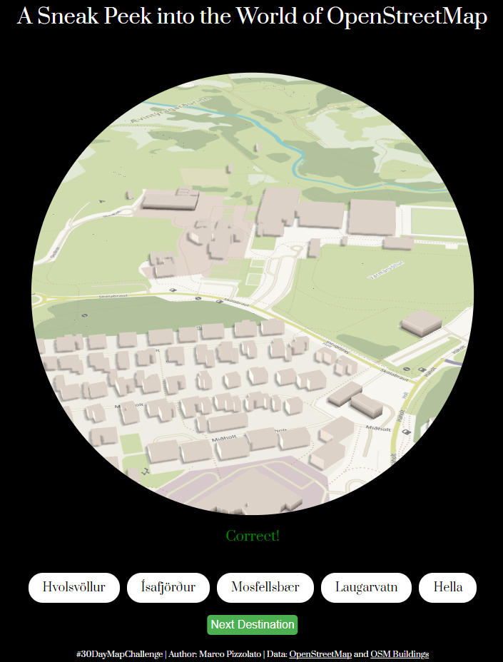

# 🌍 #30DayMapChallenge - Day 20: OpenStreetMap

**Map for day 20 of the [#30DayMapChallenge](https://30daymapchallenge.com/) 2024, created for Náttúrufræðistofnun.**

---

# 🎮 [Play the Game](https://m-lmi.github.io/30DayMapChallenge/Day-20/index.html)

### Íslenska
**Upplifðu 3D-heim OpenStreetMap með kortaleik!**

Kort dagsins er leikur sem kynnir þér þrívíddarheim OpenStreetMap í gegnum OSM Buildings. Í þessum leik geturðu:  
- Zoomað inn og út á svæðinu, horft í kringum þig og fengið tilfinningu fyrir staðsetningu þinni.  
- Reiknað út hvar þú ert og giskað á staðsetningu.  

Það er þitt verkefni að kanna, skoða og uppgötva!  

📍 **Prófaðu sjálfur**: Smelltu á kortið og byrjaðu að kanna þrívíddargögnin og byggingarnar úr OpenStreetMap. Þetta er skemmtileg og fræðandi leið til að læra meira um hvernig OSM gögn líta út í þrívídd.

📌 **Athugið**: Til að hlaða þrívíddarflísarnar (3D tiles) gæti þurft hraðan nettengil Virkar best í tölvu. Ekki prófað í farsíma. 

**#OSM #OpenStreetMap #Kortaleikur #Ísland #30DayMapChallenge**

---

### English
**Discover the 3D world of OpenStreetMap with a map game!**

Today’s map is a game that introduces you to the 3D version of OpenStreetMap using OSM Buildings. In this game, you can:  
- Zoom in and out, look around, and explore your surroundings in 3D.  
- Figure out where you are and guess the location.  

It’s up to you to explore, observe, and discover!  

📍 **Try it out**: Click on the map and start exploring the 3D data and buildings from OpenStreetMap. It’s a fun and engaging way to learn more about how OSM data looks in 3D.

📌 **Note**: A fast internet connection may be required to load 3D tiles effectively. Works best on Computer. Not tested on Mobile.   

**#OSM #OpenStreetMap #MapGame #Iceland #30DayMapChallenge**

---

### How to Play
- **Zoom and Pan**: Move around the 3D map to get a feel for your surroundings.  
- **Guess the Location**: Use your observations to figure out where you are.  
- **Explore in 3D**: Enjoy the immersive experience of OSM Buildings and learn more about OpenStreetMap's capabilities.

---

### Attribution
- **Author**: Marco Pizzolato
- **Data Source**: OpenStreetMap and OSM Buildings
- **Interactive Map**: Built for OpenStreetMap enthusiasts and explorers.

---

**License**: Creative Commons **CC BY 4.0**

---

This interactive 3D map game invites users to dive into the world of OpenStreetMap, blending fun and discovery with geographical exploration. Start your adventure now! Click on the image to start the game!

