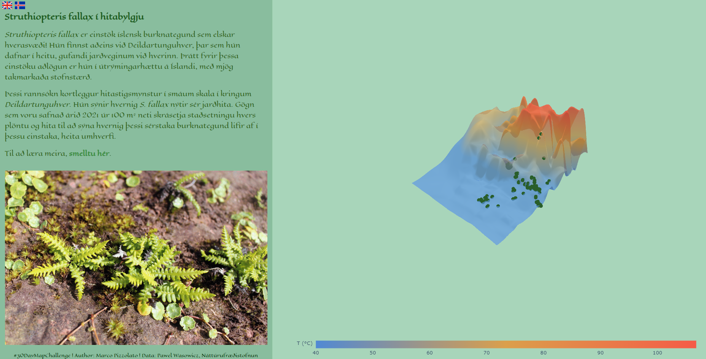
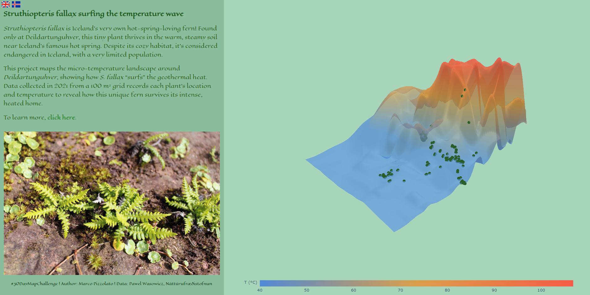

# 🌱 #30DayMapChallenge - Day 27: Micromapping

**Map for day 27 of the [#30DayMapChallenge](https://30daymapchallenge.com/) 2024, created for Náttúrufræðistofnun.**

---
# 🎮 [Ply with the map](https://m-lmi.github.io/30DayMapChallenge/Day-27/index.html)

### Íslenska
**Struthiopteris fallax í hitabylgju**

*Struthiopteris fallax* er einstök íslensk burknategund sem elskar hverasvæði! Hún finnst aðeins við **Deildartunguhver**, þar sem hún dafnar í heitu, gufandi jarðveginum við hverinn. Þrátt fyrir þessa einstöku aðlögun er hún í **útrýmingarhættu á Íslandi**, með mjög takmarkaða stofnstærð.

Þessi rannsókn kortleggur **hitastigsmynstur í smáum skala** í kringum Deildartunguhver. Hún sýnir hvernig *S. fallax* nýtir sér jarðhita. Gögn sem voru safnað árið **2021** úr **100 m² neti** skrásetja staðsetningu hvers plöntu og hita til að sýna hvernig þessi sérstaka burknategund lifir af í þessu einstaka, heita umhverfi.

📍 **Lesa meira**: [Smelltu hér](https://www.ni.is)

**#30DayMapChallenge #Micromapping #Ísland #Jarðhiti #StruthiopterisFallax #Kortagerð**

---

### English
**Struthiopteris fallax Surfing the Temperature Wave**

*Struthiopteris fallax* is Iceland’s very own hot-spring-loving fern! Found only at **Deildartunguhver**, this tiny plant thrives in the warm, steamy soil near Iceland’s famous hot spring. Despite its cozy habitat, it is considered **endangered in Iceland**, with a very limited population.

This project maps the **micro-temperature landscape** around Deildartunguhver, showing how *S. fallax* “surfs” the geothermal heat. Data collected in **2021** from a **100 m² grid** records each plant’s location and temperature, revealing how this unique fern survives its intense, heated home.

📍 **To learn more**: [Click here](https://www.ni.is)

**#30DayMapChallenge #Micromapping #Iceland #Geothermal #StruthiopterisFallax #Mapping**

### How to Use
Try the notebook to explore Icelandic roundabouts or customize it for your own region!

| Run the code via free cloud platforms: |  |  |  |
|---|---|---|---|

---

### Data Sources
- 🌍 **Data Collection**: Pawel Wasowicz and Náttúrufræðistofnun  
- 🌡️ **Temperature and Plant Locations**: 2021 field survey, 100 m² grid at Deildartunguhver  

---

### Design Credits
- **Author**: Marco Pizzolato
- **Data Visualization Tools**: Python, Plotly 

---

**License**: Creative Commons **CC BY 4.0**

---

This map highlights the remarkable adaptation of *Struthiopteris fallax* to its geothermal environment and the delicate balance needed to protect this unique Icelandic species.

